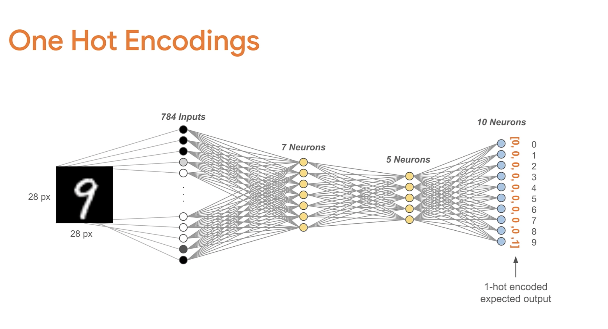
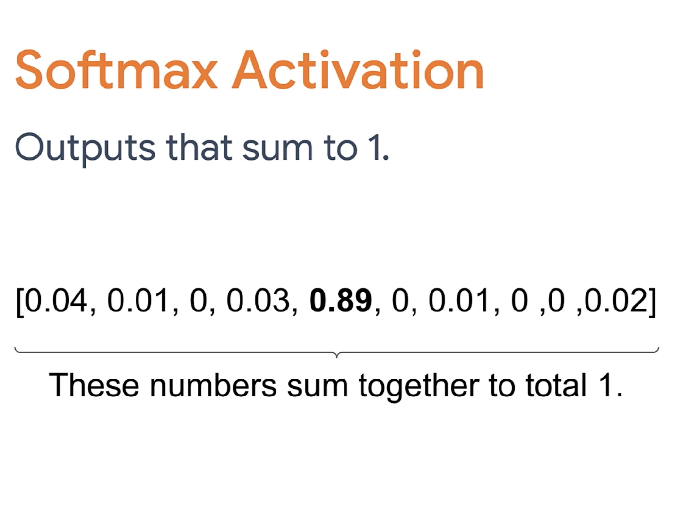

# Notes

## Processing Data

- Clean data (convert to numerical values, remove outliers, etc.)
- Normalize data (scale data to be between 0 and 1)
- Shuffle data (randomize order of data)
- Feature selection (select most important features)
- Feature engineering (create new features)
- Data bias (make sure data is representative of population)

## Gathering Trainging & Testing Data

### Strategy A

- 80% training, 20% testing
- Train model on data set -> test model on test set -> evaluate model -> repeat
- pick a model that performs best on test set

### Strategy B

- 70% training, 15% validation, 15% testing
- Train model on training set -> test model on validation set -> evaluate model -> repeat
- pick a model that performs best on validation set
- Confirm model on test set

## Perceptrons & Neural Networks

### Perceptrons

### Activation Functions

### Linear Regression

### Error Functions

### Learning Rate

- Changes how much the weights are updated
- Too high -> overshoots minimum
- Too low -> takes too long to converge
- Changes from data set to data

### Use Lost Function and tweaking weights and biases to minimize it

### Line of Best Fit

## Multi-Layer Perceptrons

### Regression

### Classification

## Convolutional Neural Networks
